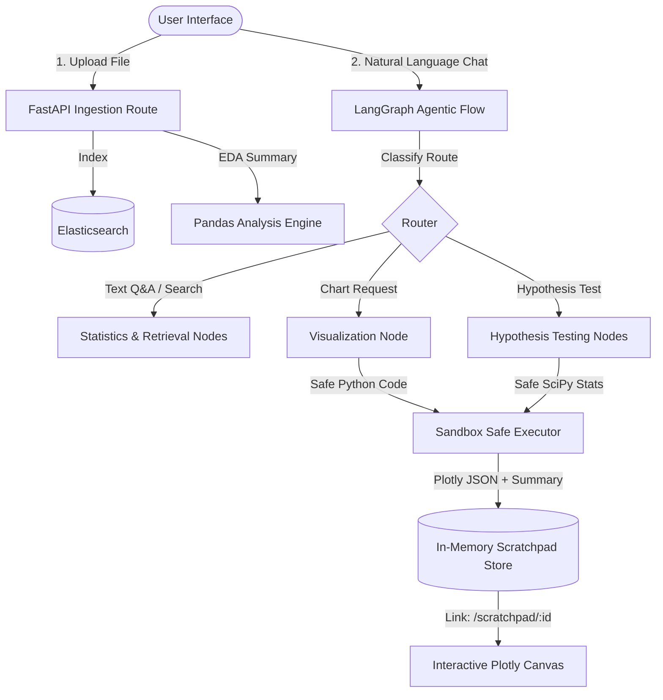

# ZmaRk MarketMind: Intelligent BI & Agentic Analytics Canvas

ZmaRk MarketMind is a next-generation Business Intelligence (BI) and conversational data analysis application. It brings the power of agentic AI workflows to raw tabular data, allowing users to upload CSVs/Excel files, view automated EDA dashboards, conduct advanced statistical tests, and generate interactive, dark-mode visualization charts through natural language chat.

---

## 🚀 Key Features

*   **Ingestion & Auto-indexing**: Upload files to automatically generate metadata summaries, run exploratory data analysis (EDA), and index data into **Elasticsearch** for semantic/keyword retrieval.
*   **Conversational BI Agent**: Powered by **FastAPI** and **LangGraph** (running Gemini models), the agent automatically routes queries to statistical analysis, policy document retrieval, data visualization, or hypothesis testing branches.
*   **ZScratchpad (Rich Output Canvas)**: A dedicated display canvas (`/scratchpad/:sessionId/:reportId`) for complex agent outputs like interactive Plotly charts and structured reports, keeping the main chat thread clean.
*   **Safe Execution Sandbox**: Safely compiles and executes LLM-generated Plotly Python code in a restricted namespace (`pandas`, `numpy`, `plotly`, `scipy`, `math`, `statistics` only).
*   **Interactive Hypothesis Testing**: Walks users through custom hypothesis tests (T-Test, ANOVA, Chi-Square) via a dynamic frontend Clarification Form built with chips/selectors.
*   **Clean Chat Interface**: Clean, plain-prose chat bubbles with superscript citation markers referencing specific rows or documents in a dedicated references footer.

---

## 🛠 Tech Stack

*   **Frontend**: React (Vite), React Router DOM, React-Plotly.js (Plotly.js), Tailwind CSS / Custom CSS, Lucide Icons
*   **Backend**: FastAPI, LangGraph, Pandas, NumPy, SciPy, Google Generative AI (Gemini SDK), Elasticsearch (via Elastic Cloud or local)
*   **Licensing**: OSI-Approved MIT License

---

## 📐 Architecture



---

## 📦 Getting Started

### Backend Setup

1. Navigate to the backend directory:
   ```bash
   cd backend
   ```
2. Create and activate a virtual environment:
   ```bash
   python -m venv venv
   source venv/bin/activate  # On Windows: venv\Scripts\activate
   ```
3. Install dependencies:
   ```bash
   pip install -r requirements.txt
   ```
4. Set up environment variables in a `.env` file at the root:
   ```env
   GEMINI_API_KEY=your_gemini_api_key
   ELASTIC_KEY=your_elasticsearch_api_key
   ELASTIC_URL=your_elasticsearch_url
   ELASTIC_CLUSTER=your_elasticsearch_cluster_id
   ```
5. Run the FastAPI development server:
   ```bash
   uvicorn app.main:app --reload --port 8000
   ```

### Frontend Setup

1. Navigate to the frontend directory:
   ```bash
   cd frontend
   ```
2. Install dependencies:
   ```bash
   npm install
   ```
3. Start the Vite development server:
   ```bash
   npm run dev
   ```
4. Open the browser at `http://localhost:5173`.

---

## 📜 License

This project is licensed under the OSI-approved **MIT License**. See the [LICENSE](file:///c:/Users/Bot/Desktop/ZmaRk%20hack/LICENSE) file in the root for details.

---

## 📝 ZScratchpad + Chat Formatting Implementation Plan

Below is the implementation plan that was followed to design, implement, and verify the scratchpad canvas, chat citations, code sandbox, and LangGraph branches.

***

### 1. File Map
*   **New backend files:**
    *   `backend/app/services/scratchpad.py` — Ephemeral thread-safe session-scoped scratchpad store.
    *   `backend/app/services/sandbox.py` — Safe execution sandbox evaluating code and returning serialization-safe Plotly figures + metadata.
    *   `backend/app/api/v1/routes/scratchpad.py` — API routes to fetch artifacts by ID.
*   **Modified backend files:**
    *   `backend/app/schemas/analytics.py` — Added schemas for `ClarificationForm`, `ScratchpadArtifact`, and updated `ChatMessage` model.
    *   `backend/app/services/chat_graph.py` — Extended the routing classifier and compiled LangGraph with `visualization_node`, `hypothesis_clarify_node`, and `hypothesis_run_node`. Added Gemini system instructions to strip out unwanted formatting.
*   **New frontend files:**
    *   `frontend/src/ScratchpadPage.jsx` — Viewport containing full-page Plotly charts, metadata chips, and plain-text summaries.
    *   `frontend/src/ChatBubble.jsx` — Component supporting plain prose, citation superscript markers, references list, and cards to open charts in ZScratchpad.
    *   `frontend/src/ClarificationForm.jsx` — Renders chips and selectors for hypothesis testing metrics and group filters.
*   **Modified frontend files:**
    *   `frontend/src/main.jsx` — Integrated React Router DOM (`/scratchpad/:sessionId/:reportId` route) and swapped inline chat list with the new components.

***

### 2. Implementation Tasks

#### Task 1: Ephemeral Scratchpad Store
Creates `backend/app/services/scratchpad.py` to persist generated Plotly plots and summaries in an in-memory dictionary grouped by session IDs, wrapped in a thread-safe mutex lock.
*   `save_artifact(session_id, artifact) -> report_id`
*   `get_artifact(session_id, report_id) -> Optional[dict]`
*   `delete_session_artifacts(session_id) -> None`

#### Task 2: Restricted Execution Sandbox
Creates `backend/app/services/sandbox.py` to sanitize and execute generated Plotly graphing code. Blocks global functions (`open`, `exec`, `eval`, `compile`, etc.) and restricts imports exclusively to `pandas`, `numpy`, `plotly`, `scipy`, `math`, and `statistics`. Attaches `plotly.express` and `plotly.graph_objects` namespaces so graphs can compile into standard dictionary formats.

#### Task 3: API Gateway & Models
Extends FastAPI schemas in `backend/app/schemas/analytics.py` to support `scratchpad_link` and `clarification_form` within the payload. Mounts a new route router at `backend/app/api/v1/routes/scratchpad.py` handling `GET /api/v1/scratchpad/{session_id}/{report_id}` to retrieve active figures.

#### Task 4: LangGraph Routing Logic
*   **Classify**: Parses query keywords to route flows to `statistics`, `retrieval`, `visualization`, `hypothesis_clarify`, or `hypothesis_run`.
*   **Visualization Node**: Triggers Gemini to write safe Plotly code targeting dataset headers. Runs it inside the sandbox, saves output to the scratchpad store, and responds with a direct link card.
*   **Hypothesis Clarification**: Detects testing queries (e.g. *"run a t-test"*). Populates a clarification form configuration listing valid columns (e.g. `metric`, `group_a`, `group_b`, `alpha`) so the frontend can display selectors.
*   **Hypothesis Run**: Extracts parameter values sent back by the form (e.g., `metric=revenue, group_a=GPU, ...`) and executes a SciPy independent T-test. Generates side-by-side box plots, computes p-value/t-statistics, and posts the report.

#### Task 5: Clean Response Formatting
Configures Gemini prompt restrictions:
*   Prohibits markdown bold (`**`), italic (`*`), headers, and lists.
*   Bans em-dashes (`—`).
*   Requires citations to use standard `[n]` formats pointing to sources.
*   Limits outputs to a maximum of 4 sentences.

#### Task 6: Frontend Interface Components
*   `ChatBubble.jsx`: Splits text contents on `[n]` patterns, styling them as superscript tags. Appends a card if `scratchpad_link` is present, allowing users to launch the visualization page.
*   `ClarificationForm.jsx`: Dynamically formats choices (e.g., significance levels `0.01`, `0.05`, `0.10`) as active/inactive chips. When submitted, combines results into a comma-delimited string (e.g., `metric=Sales, group_a=Nordic, group_b=Asia`) and sends it directly to the chat client.
*   `ScratchpadPage.jsx`: Directs users to `/scratchpad/:sessionId/:reportId`. Renders responsive interactive Plotly plots (`react-plotly.js`) aligned with the application's overall dark-mode color scheme.
